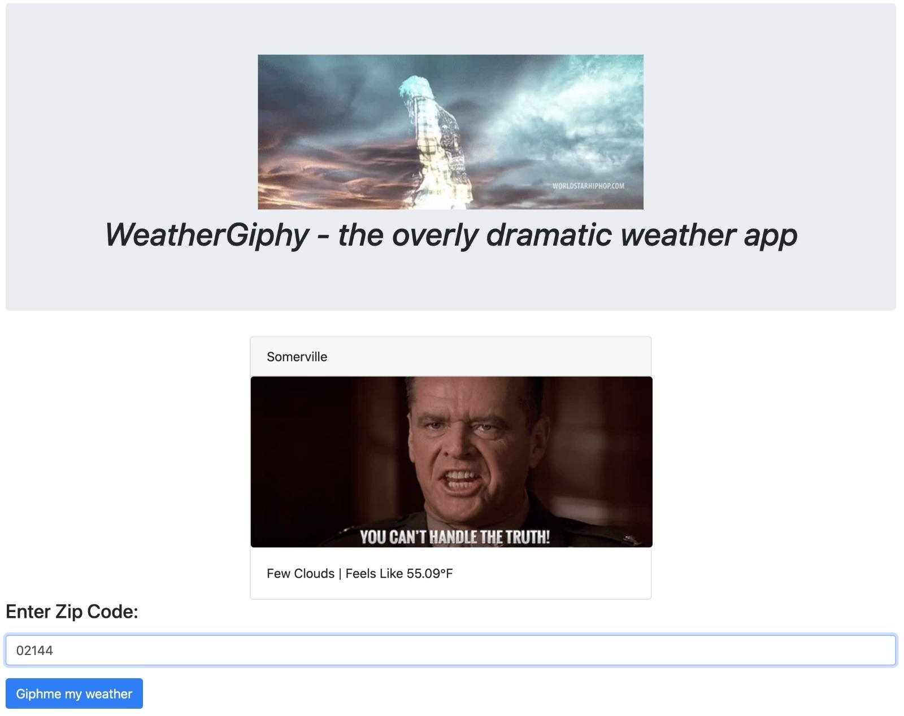
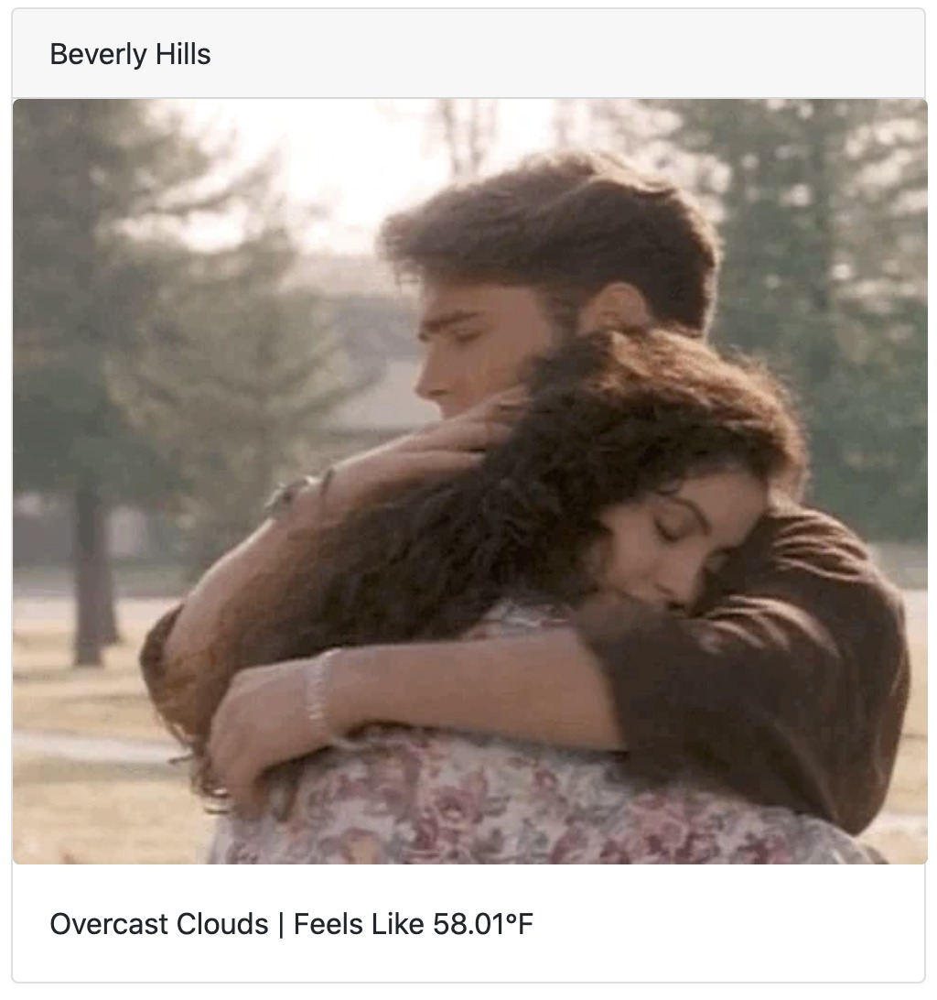
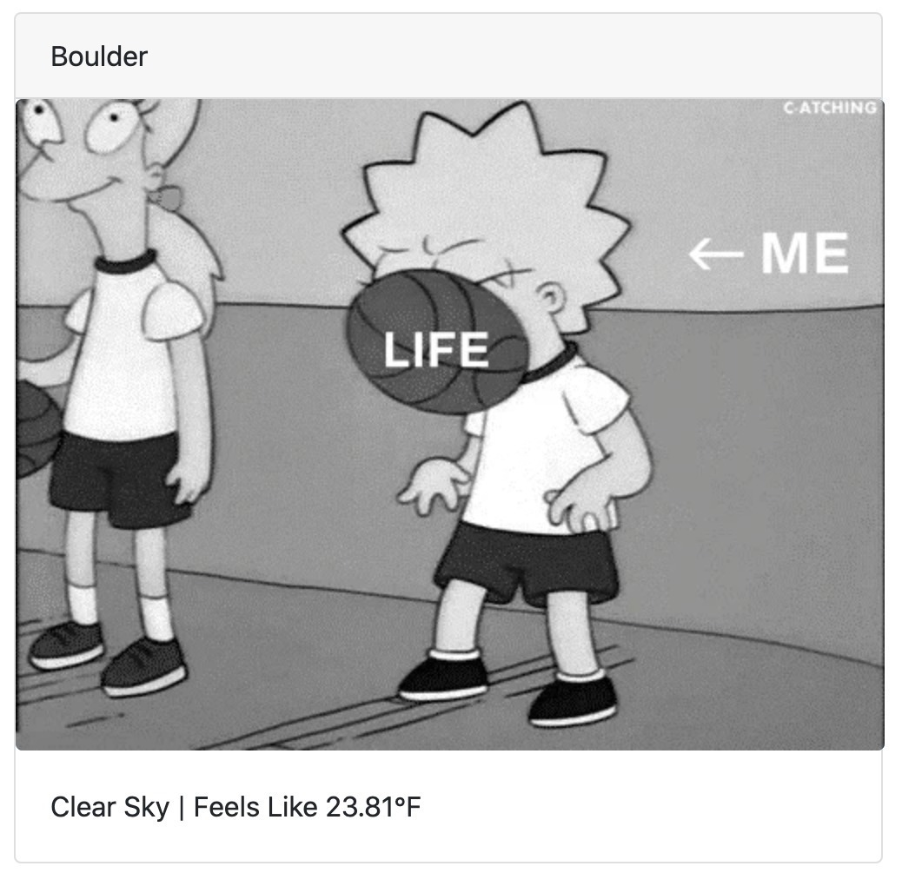

# WeatherGiphy!

Gives you the current weather of a location, but in a giphy format and in an overly dramatic fashion!

A simple [create-react-app](CRA-README.md) setup with React-Bootstrap.

Uses https://openweathermap.org/current and https://developers.giphy.com/docs/ap

## Installation

```shell
% yarn install
% yarn start
```

The app relies on two API keys, one from OpenWeather and one from Giphy and are stored in the following format in a
`.env` file at the project root:

```javascript
REACT_APP_OPEN_WEATHER_API_KEY = <API_KEY>
REACT_APP_GIPHY_API_KEY = <API_KEY>
``` 

## Caveats:

- This app is only available in the United States and uses Fahrenheit.

## Testing:

`yarn test --verbose`

## Screenshots:



